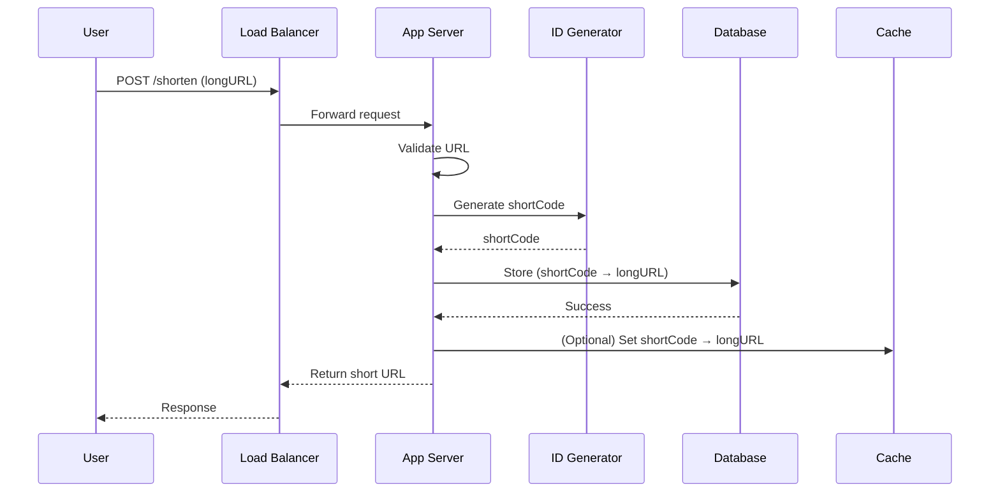
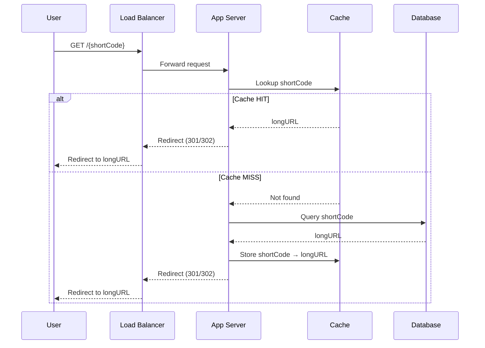

<!-- START doctoc generated TOC please keep comment here to allow auto update -->
<!-- DON'T EDIT THIS SECTION, INSTEAD RE-RUN doctoc TO UPDATE -->
**Table of Contents**  *generated with [DocToc](https://github.com/thlorenz/doctoc)*

- [Date Flow - URL Shortener](#date-flow---url-shortener)
  - [Goal](#goal)
  - [1. Write Flow (URL Shortening)](#1-write-flow-url-shortening)
    - [Steps](#steps)
  - [2. Read Flow (URL Redirect)](#2-read-flow-url-redirect)
    - [Steps](#steps-1)
  - [3. Cache Strategy (Cache-Aside)](#3-cache-strategy-cache-aside)
    - [Read Path](#read-path)
    - [Write Path](#write-path)
  - [Write Flow – Sequence Diagram](#write-flow--sequence-diagram)
  - [Read Flow – Sequence Diagram](#read-flow--sequence-diagram)
  - [Key Observations](#key-observations)
  - [Trade-offs](#trade-offs)
  - [Summary](#summary)

<!-- END doctoc generated TOC please keep comment here to allow auto update -->

# Data Flow - URL Shortener

## Goal
Explain how data moves through the system for both write (shortening) and read (redirect) operations, with a focus on cache usage.

---

## 1. Write Flow (URL Shortening)

This flow handles creating a short URL from a long URL.

### Steps

1. User sends a request to shorten a URL
    > `POST /shorten` with long URL

2.  Request hits the Load Balancer
    > Routed to an available App Server

3. App Server validates input
    > Checks URL format, duplicates (optional)

4. Generate unique short code
    > Using ID generator (e.g., Base62 encoding)

5. Store mapping in Database
    > `{shortCode -> longURL}`

6. (Optional) Store in Cache
    > Pre-warm cache for faster first read

7. Return response to user
    > Short URL is returned

---

## 2. Read Flow (URL Redirect)

This flow handles redirecting users from a short URL to the original URL.

### Steps

1. User accesses short URL
    > `GET /{shortCode}`

2. Request hits Load Balancer
    > Routed to an App Server

3. App Server checks Cache (Redis)
    > Lookup `shortCode`

4. Cache HIT
    > Return long URL immediately

    > Redirect user (HTTP 301 or 302)

5. Cache MISS
    > Query Database

6. Database returns long URL
    > `{ shortCode -> longURL }`

7. Store result in Cache
    > Cache-aside strategy

8. Redirect user
    > HTTP 301 (performance) or 302 (analytics flexibility)

---

## 3. Cache Strategy (Cache-Aside)

The system uses a **cache-first (cache-aside)** strategy:

### Read Path
- Always check cache first
- Fall back to database on miss
- Populate cache after DB read

### Write Path
- Write goes directly to database
- Cache is updated optionally (or lazily on read)

---

## Write Flow – Sequence Diagram

---

---

## Read Flow – Sequence Diagram

---
## Key Observations

- System is **read-heavy (≈10:1)** -> caching is critical
- Cache significantly reduces database load
- Cache-aside provides better control over consistency
- Redirect latency is minimized on cache hits

---

## Trade-offs

| Decision             | Benefit                  | Trade-off                 |
|----------------------|--------------------------|---------------------------|
| Cache-first strategy | Faster reads             | Possible stale data      |
| 301 Redirect         | Better performance & SEO | Harder to track analytics |
| 302 Redirect         | Better tracking          | Slightly slower           |

---

## Summary

- Write flow focuses on **ID generation + persistence**
- Read flow is optimized for **speed via caching**
- Cache plays a central role in system performance
